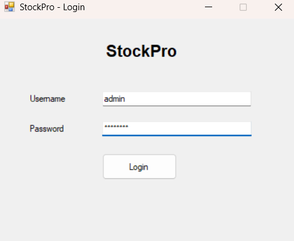
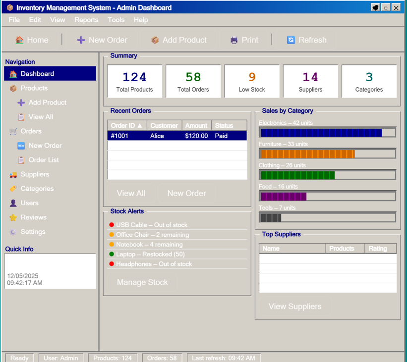
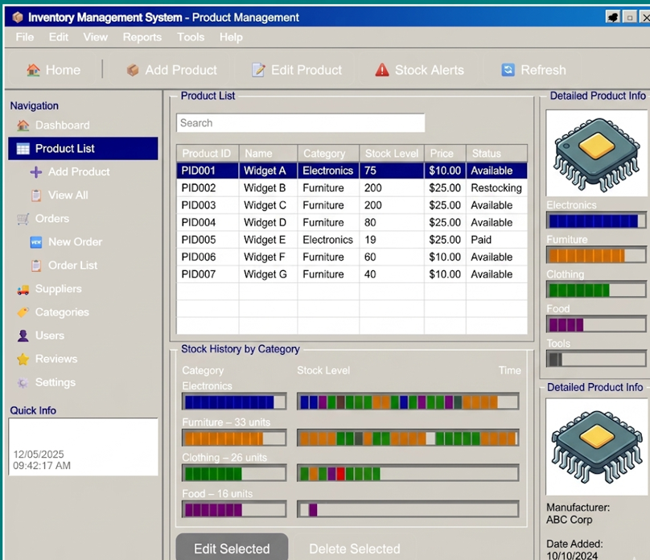
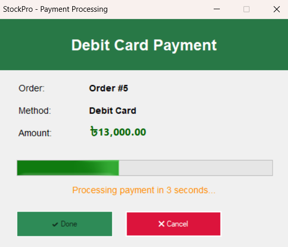
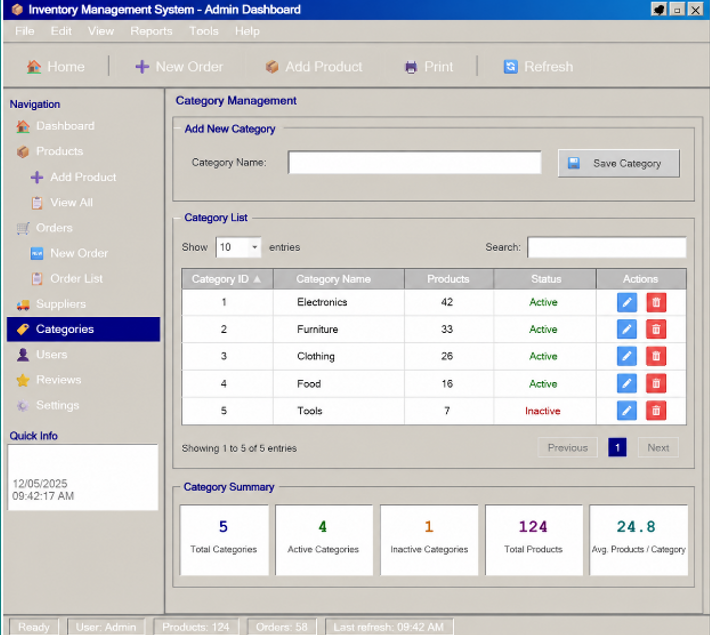
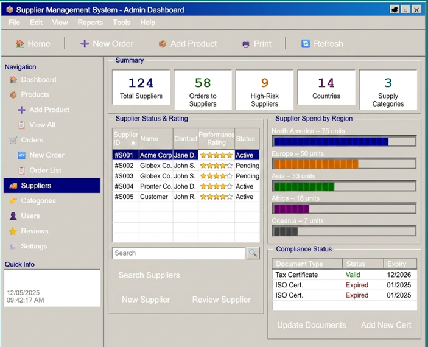
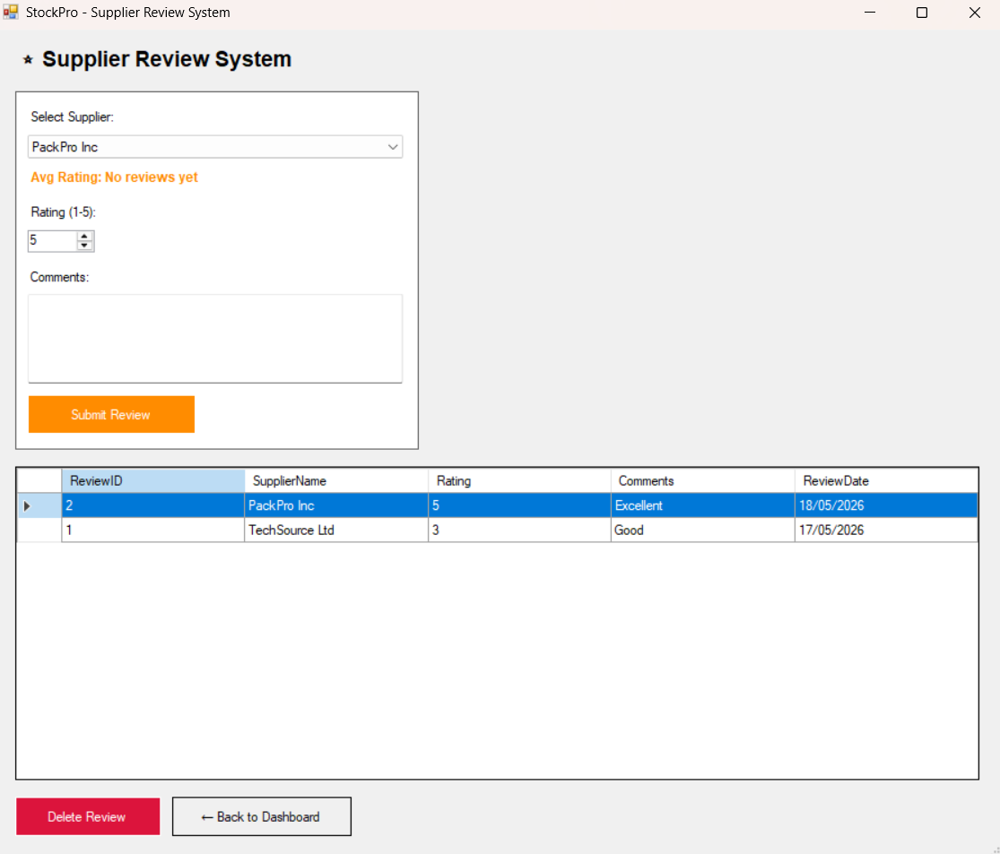
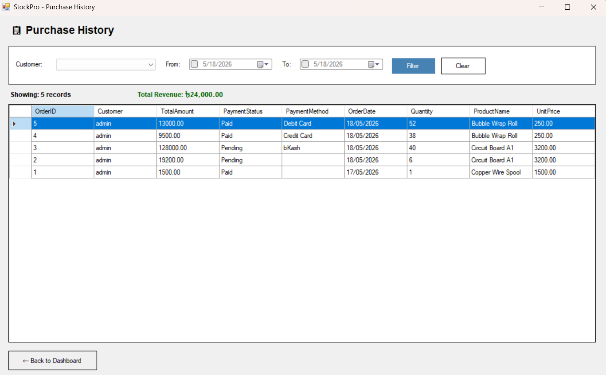
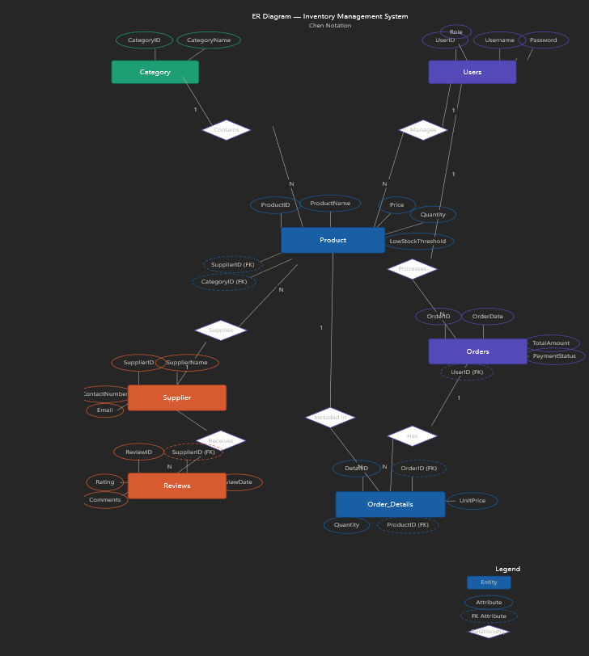

# StockPro — Integrated Warehouse Logistics & Payment Management System

StockPro is a desktop application built with **C# (WinForms)** and **SQL Server** that solves the inefficiencies of manual, paper-based inventory tracking in large-scale warehouses. It provides real-time stock tracking, automated low-stock alerts, role-based access control, and integrated payment processing.

---

## Screenshots

| Login Screen | Admin Dashboard |
|---|---|
|  |  |

| Product Management | Payment Gateway |
|---|---|
|  |  |

| Category Management | Supplier Management |
|---|---|
|  |  |

| Reviews | Purchase History |
|---|---|
|  |  |

---

## Features

- **Admin Dashboard** — Summary cards for total products, orders, low stock, suppliers, and categories. 
- **Product Management** — Add, edit, delete products with real-time stock level tracking
- **Low Stock Alerts** — Automatically flags items below their set threshold
- **Order Management** — Create and manage orders with full payment method selection
- **Payment Gateway** — View all orders, mark as Paid/Pending/Failed, see total revenue
- **Payment Redirect** — Animated dummy payment screen supporting bKash, Nagad, Visa, Debit Card, and Cash
- **Supplier Management** — Add and manage supplier information
- **Category Management** — Organize products into categories
- **User Management** — Create accounts with role-based access
- **Review System** — 1-to-5 star product and supplier review tracking
- **Purchase History** — View past orders per user
- **Role-Based Access** — UI adjusts automatically based on role (Admin /Manager/ Logistics)

---

## Payment Methods Supported

- bKash
- Nagad
- Visa / Credit Card
- Debit Card
- Cash

---

## Tech Stack

| Layer | Technology |
|---|---|
| Language | C# (.NET Framework) |
| UI | Windows Forms (WinForms) |
| Database | Microsoft SQL Server |
| IDE | Visual Studio |

---

## Database Schema

The system uses a 3rd Normal Form (3NF) database design with 7 tables:

`Users` `Supplier` `Category` `Product` `Orders` `Order_Details` `Reviews`

### ER Diagram


---

## Getting Started

### Prerequisites

- Visual Studio 2019 or later
- SQL Server (any edition)
- SQL Server Management Studio (SSMS)
- .NET Framework 4.7.2 or later

### Setup Steps

**1. Clone or download the repository**
```
git clone https://github.com/Sam-Codes77/StockPro-Warehouse.git
```

**2. Restore the database**
- Open SSMS
- Create a new database named `StockProDB`
- Open `Database/setup.sql` from the repo
- Run the script — this creates all tables and inserts sample data

**3. Update the connection string**
- Open `DBHelper.cs` in the project
- Update the connection string to match your SQL Server:
```csharp
"Server=YOUR_SERVER_NAME;Database=StockProDB;Integrated Security=True;"
```

**4. Build and Run**
- Open `StockPro.sln` in Visual Studio
- Press `Ctrl+F5` to build and run

---

## Project Structure

```
StockPro-Warehouse/
├── Database/
│   └── setup.sql                 # Full database backup
├── AdminDashboard.cs             # Main dashboard
├── AdminDashboard.Designer.cs
├── PaymentGateway.cs             # Order & payment management
├── PaymentGateway.Designer.cs
├── PaymentRedirect.cs            # Dummy payment processing screen
├── PaymentRedirect.Designer.cs
├── ProductManagement.cs
├── SupplierManagement.cs
├── CategoryManagement.cs
├── CreateAccount.cs
├── ReviewSystem.cs
├── PurchaseHistory.cs
├── SalesReport.cs
├── DBHelper.cs                   # All database queries
├── Session.cs                    # Logged-in user session
└── StockPro.sln                  # Visual Studio solution file
```

---

## Case Study

**Apex Central Warehouse** faced stock-outs, lack of accountability, and lost revenue due to manual tracking errors. StockPro solves this with real-time tracking, automated low-stock alerts, and integrated financial processing.

### User Roles

- **Admin** (Warehouse Director) — manages accounts, configures thresholds, oversees financial history
- **Inventory Manager** — adds products, adjusts stock, evaluates suppliers
- **Logistics / Sales Staff** — processes outbound orders and handles payments

